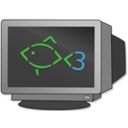
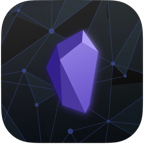

  

<h1 align="center">👋 Hi, I'm VV0JC13CH (Wojciech <a href="https://upload.wikimedia.org/wikipedia/commons/1/10/Pl-Wojciech.ogg" target="_blank" rel="noreferrer">🔊</a>)</h1>
<h3 align="center">I create work-in-progress-side-projects ;-)</h3>

  

- 🏆 The best projects are available at [https://bitstudio.dev/projects](https://bitstudio.dev/projects)
- 💩 The rest of my projects is available [here](https://github.com/VV0JC13CH?tab=repositories&q=&type=public&language=&sort=stargazers).

<h3 align="left">Activity:</h3>

 

<h3 align="left">Favorite Languages:</h3>

<a href="https://github.com/VV0JC13CH?tab=repositories">
<a/>
&nbsp;	&nbsp;	&nbsp;

&nbsp;	&nbsp;	&nbsp;
  
&nbsp;	&nbsp;	&nbsp;
<a href="https://github.com/VV0JC13CH?tab=repositories&q=&type=&language=go&sort=stargazers">    

<h3 align="left">Favorite Software:</h3>

<h3 align="left">Connect with me:</h3>

